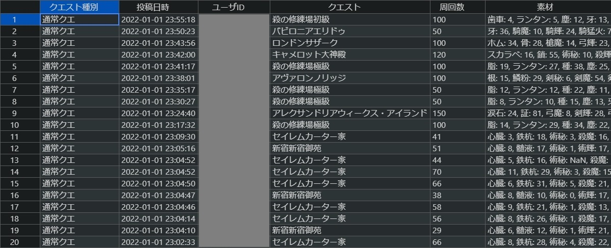
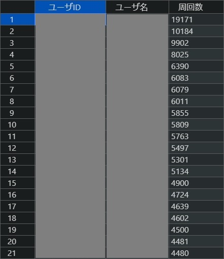
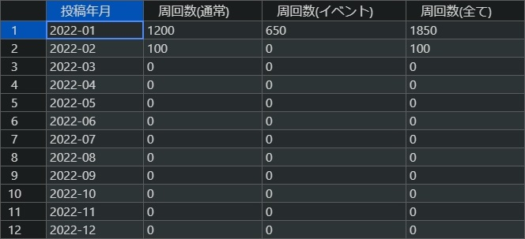

# fgo-farm-report-collection (FGO周回報告収集) <!-- omit in toc -->


# 0. 目次 <!-- omit in toc -->

- [1. 概要](#1-概要)
- [2. 機能](#2-機能)
- [3. 動作確認済み環境](#3-動作確認済み環境)
- [4. セットアップ手順](#4-セットアップ手順)
- [5. 使い方](#5-使い方)
  - [5.1. 周回報告一覧生成](#51-周回報告一覧生成)
    - [5.1.1. 実行コマンド](#511-実行コマンド)
    - [5.1.2. 実行結果](#512-実行結果)
  - [5.2. 周回報告概要生成](#52-周回報告概要生成)
    - [5.2.1. 実行コマンド](#521-実行コマンド)
    - [5.2.2. 実行結果](#522-実行結果)
  - [5.3. 周回報告実績生成](#53-周回報告実績生成)
    - [5.3.1. 実行コマンド](#531-実行コマンド)
    - [5.3.2. 実行結果](#532-実行結果)
- [6. 連絡先](#6-連絡先)
- [7. ライセンス](#7-ライセンス)


# 1. 概要

FGOの周回報告をWebスクレイピングにより収集・集計し、csvファイルに保存する。

また、そのcsvファイルの一部は`twitter-lib-for-me`リポジトリの入力ファイルになる。


# 2. 機能

アプリケーションとしてコマンドラインから実行できる。

- 周回報告一覧生成
  - 周回報告一覧ファイルを生成する
- 周回報告概要生成
  - 周回報告一覧ファイル、周回報告概要ファイルを生成する
- 周回報告実績生成
  - 周回報告一覧ファイル、周回報告実績ファイルを生成する


# 3. 動作確認済み環境

- Windows 10 Pro
- Python 3.10.1
- Pipenv 2022.1.8


# 4. セットアップ手順

セットアップにあたり前提として、PythonとPipenvがインストール済みであること。

まず、下記リポジトリをクローンもしくはダウンロードする。

- fgo-farm-report-collection
  - 本リポジトリ
- python-lib-for-me
  - 自分用のPythonライブラリ

次に、下記コマンドを実行する。

実行例：
```cmd
> cd fgo-farm-report-collection   # アプリケーションのパスに移動する
> set PIPENV_VENV_IN_PROJECT=true # 仮想環境のインストール先をアプリケーション配下に設定する
> pipenv install                  # 仮想環境をインストールする
```

次に、下記コマンドを実行して、アプリケーション配下に`.venv`フォルダが作成されていることを確認する。

実行例：
```cmd
> pipenv --venv                   # 仮想環境のインストール先を表示する
C:/Git/python/twitter-lib-for-me/.venv
```


# 5. 使い方

アプリケーションの実行手順を機能ごとに示す。


## 5.1. 周回報告一覧生成


### 5.1.1. 実行コマンド

下記コマンドを実行する。

実行例：
```cmd
> cd fgo-farm-report-collection
> pipenv run list-gen 2022-01
[2022-02-11 21:56:15.985][INF][farm_report_list_gen:0044][main] 実行コマンド：['farm_report_list_gen.py', '2022-01']
[2022-02-11 21:56:15.988][INF][farm_report_list_gen:0027][do_logic] 周回報告一覧生成を開始します。
[2022-02-11 21:56:15.990][INF][farm_report_list_gen:0065][do_logic] 周回報告一覧を生成します。(2022-01-01～2022-01-31)
[2022-02-11 21:56:15.991][INF][farm_report_list_gen:0069][do_logic] 周回報告一覧ファイル：./dest/farm_report_list/farm_report_list_2022-01.csv
[2022-02-11 21:56:15.993][INF][farm_report_list_gen:0169][__generate_farm_report_list_file] https://fgojunks.max747.org/harvest/contents/date/2022-01-01.html
[2022-02-11 21:56:16.450][INF][farm_report_list_gen:0169][__generate_farm_report_list_file] https://fgojunks.max747.org/harvest/contents/date/2022-01-02.html
[2022-02-11 21:56:16.957][INF][farm_report_list_gen:0169][__generate_farm_report_list_file] https://fgojunks.max747.org/harvest/contents/date/2022-01-03.html
...
[2022-02-11 21:56:28.818][INF][farm_report_list_gen:0169][__generate_farm_report_list_file] https://fgojunks.max747.org/harvest/contents/date/2022-01-29.html
[2022-02-11 21:56:29.260][INF][farm_report_list_gen:0169][__generate_farm_report_list_file] https://fgojunks.max747.org/harvest/contents/date/2022-01-30.html
[2022-02-11 21:56:29.830][INF][farm_report_list_gen:0169][__generate_farm_report_list_file] https://fgojunks.max747.org/harvest/contents/date/2022-01-31.html
[2022-02-11 21:56:30.228][INF][farm_report_list_gen:0219][__generate_farm_report_list_file] 周回報告一覧(追加分先頭n行)
     quest_kind         posting_date          user_id                 quest_place num_of_farms                                                         material
0      通常クエ  2022-01-01 23:55:18       xxxxxxxxxx              殺の修練場初級          100  歯車: 4, ランタン: 5, 塵: 12, 牙: 13, 殺輝: 145, 殺モ: 5, ...  
1      通常クエ  2022-01-01 23:50:23       xxxxxxxxxx          バビロニアエリドゥ           50              牙: 36, 騎魔: 10, 騎輝: 24, 騎猛火: 7              
2      通常クエ  2022-01-01 23:43:56       xxxxxxxxxx            ロンドンサザーク          100  ホム: 34, 骨: 28, 槍魔: 14, 弓輝: 23, 槍輝: 40, 槍灯火: 17...  
3      通常クエ  2022-01-01 23:42:00       xxxxxxxxxx          キャメロット大神殿          120  スカラベ: 16, 鎖: 55, 術秘: 10, 殺輝: 9, 狂輝: 17, 術業火: 2...
4      通常クエ  2022-01-01 23:41:17       xxxxxxxxxx              殺の修練場極級          100  脂: 19, ランタン: 27, 種: 38, 塵: 25, 牙: 32, 鎖: 23, 殺...    
[2022-02-11 21:56:30.237][INF][farm_report_list_gen:0220][__generate_farm_report_list_file] 周回報告一覧(追加分末尾n行)
     quest_kind         posting_date          user_id                 quest_place num_of_farms                                                        material
2260   通常クエ  2022-01-31 04:00:10       xxxxxxxxxx        オケアノス隠された島           25              貝殻: 4, 剣魔: 1, 剣輝: 13, 剣猛火: 1             
2261   通常クエ  2022-01-31 02:04:40       xxxxxxxxxx          セプテムエトナ火山          200                             ランタン: 22, 殺輝: 77             
2262   通常クエ  2022-01-31 00:19:18       xxxxxxxxxx              下総国荒川の原          350  胆石: 51, 勾玉: 75, 塵: 105, 狂秘: 11, 剣魔: 117, 剣猛火: ... 
2263   通常クエ  2022-01-31 00:15:54       xxxxxxxxxx      キャメロット砂嵐の砂漠          160  スカラベ: 15, 骨: 119, 術秘: 5, 剣輝: 19, 弓輝: 19, 槍輝: 1...
2264   通常クエ  2022-01-31 00:00:01       xxxxxxxxxx  アナスタシアヤガ・モスクワ          100                     結氷: 47, 殺魔: 49, 殺猛火: 37             
[2022-02-11 21:56:30.252][INF][farm_report_list_gen:0076][do_logic] 周回報告一覧生成を終了します。
```

また、ヘルプを呼び出す時は下記コマンドを実行する。

実行例：
```cmd
> pipenv run list-gen -h
usage: farm_report_list_gen.py [-h] col_year_month

positional arguments:
  col_year_month  収集年月(yyyy-mm形式)

options:
  -h, --help      show this help message and exit
```


### 5.1.2. 実行結果

周回報告一覧ファイルが下記パスに生成される。

| 種類         | ファイルパス                                             |
| ------------ | -------------------------------------------------------- |
| フォーマット | ./dest/farm_report_list/farm_report_list\_[収集年月].csv |
| 例           | ./dest/farm_report_list/farm_report_list_2022-01.csv     |

また、下記画像はあるエディタ(editcsv)で開いた際のデータ例である。




## 5.2. 周回報告概要生成


### 5.2.1. 実行コマンド

下記コマンドを実行する。

実行例：
```cmd
> cd fgo-farm-report-collection
> pipenv run sum-gen 2022-01 -a 100
[2022-02-11 21:56:54.294][INF][farm_report_summary_gen:0049][main] 実行コマンド：['farm_report_summary_gen.py', '2022-01', '-a', '100']
[2022-02-11 21:56:54.298][INF][farm_report_list_gen:0027][do_logic] 周回報告一覧生成を開始します。
[2022-02-11 21:56:54.323][INF][farm_report_list_gen:0058][do_logic] 周回報告一覧は最新です。(2022-01)
[2022-02-11 21:56:54.323][INF][farm_report_list_gen:0076][do_logic] 周回報告一覧生成を終了します。
[2022-02-11 21:56:54.324][INF][farm_report_summary_gen:0028][do_logic] 周回報告概要生成を開始します。
[2022-02-11 21:56:54.324][INF][farm_report_summary_gen:0052][do_logic] 周回報告概要ファイル：./dest/farm_report_summary/farm_report_summary_2022-01_全て_100周以上.csv
[2022-02-11 21:56:54.351][INF][farm_report_summary_gen:0128][__generate_farm_report_summary_file] 
                user_name  num_of_farms
user_id                                
xxxxxxxxxx              -         19171
xxxxxxxxxx              -         10184
xxxxxxxxxx              -          9902
xxxxxxxxxx              -          8025
xxxxxxxxxx              -          6390
...                   ...           ...
xxxxxxxxxx              -           100
xxxxxxxxxx              -           100
xxxxxxxxxx              -           100
xxxxxxxxxx              -           100
xxxxxxxxxx              -           100

[283 rows x 2 columns]
[2022-02-11 21:56:54.354][INF][farm_report_summary_gen:0061][do_logic] 周回報告概要生成を終了します。
```

また、ヘルプを呼び出す時は下記コマンドを実行する。

実行例：
```cmd
> pipenv run sum-gen -h
usage: farm_report_summary_gen.py [-h] (-a MIN_NUM_OF_ALL_QUEST | -n MIN_NUM_OF_NORMAL_QUEST | -e MIN_NUM_OF_EVENT_QUEST) [-u] col_year_month

positional arguments:
  col_year_month        収集年月(yyyy-mm形式)

options:
  -h, --help            show this help message and exit
  -a MIN_NUM_OF_ALL_QUEST, --min_num_of_all_quest MIN_NUM_OF_ALL_QUEST
                        最低周回数(全て)
                        グループで1つのみ必須
  -n MIN_NUM_OF_NORMAL_QUEST, --min_num_of_normal_quest MIN_NUM_OF_NORMAL_QUEST
                        最低周回数(通常クエ)
                        グループで1つのみ必須
  -e MIN_NUM_OF_EVENT_QUEST, --min_num_of_event_quest MIN_NUM_OF_EVENT_QUEST
                        最低周回数(イベクエ)
                        グループで1つのみ必須
  -u, --should_output_user_name
                        ユーザ名出力要否
```


### 5.2.2. 実行結果

周回報告一覧ファイルが[周回報告一覧生成](#51-周回報告一覧生成)と同様に生成され、周回報告概要ファイルが下記パスに生成される。

| 種類         | ファイルパス                                                                                 |
| ------------ | -------------------------------------------------------------------------------------------- |
| フォーマット | ./dest/farm_report_summary/farm_report_summary\_[収集年月]\_[クエスト種別]\_[最低周回数].csv |
| 例           | ./dest/farm_report_summary/farm_report_summary_2022-01_全て_100周以上.csv                    |

また、下記画像はあるエディタ(editcsv)で開いた際のデータ例である。




## 5.3. 周回報告実績生成


### 5.3.1. 実行コマンド

下記コマンドを実行する。

実行例：
```cmd
> cd fgo-farm-report-collection
> pipenv run per-gen 2022 silverag_corgi
[2022-02-11 22:54:01.388][INF][farm_report_performance_gen:0047][main] 実行コマンド：['farm_report_performance_gen.py', '2022', 'silverag_corgi']
[2022-02-11 22:54:01.392][INF][farm_report_performance_gen:0024][do_logic] 周回報告実績生成を開始します。
[2022-02-11 22:54:01.442][INF][farm_report_performance_gen:0079][do_logic] 周回報告実績
   posting_month  num_of_farms_for_normal  num_of_farms_for_event  num_of_farms_for_all
0        2022-01                     1200                     650                  1850
1        2022-02                      100                       0                   100
2        2022-03                        0                       0                     0
3        2022-04                        0                       0                     0
4        2022-05                        0                       0                     0
5        2022-06                        0                       0                     0
6        2022-07                        0                       0                     0
7        2022-08                        0                       0                     0
8        2022-09                        0                       0                     0
9        2022-10                        0                       0                     0
10       2022-11                        0                       0                     0
11       2022-12                        0                       0                     0
[2022-02-11 22:54:01.444][INF][farm_report_performance_gen:0083][do_logic] 周回報告実績生成を終了します。
```

また、ヘルプを呼び出す時は下記コマンドを実行する。

実行例：
```cmd
> pipenv run per-gen -h
[2022-02-11 22:57:38.900][INF][farm_report_performance_gen:0047][main] 実行コマンド：['farm_report_performance_gen.py', '-h']
usage: farm_report_performance_gen.py [-h] [-l] col_year user_id

positional arguments:
  col_year              収集年(yyyy形式)
  user_id               ユーザID(Twitter)

options:
  -h, --help            show this help message and exit
  -l, --should_generate_list
                        周回報告一覧生成要否
                        指定した場合は一覧を生成するが、指定しなかった場合は生成せずに既存の一覧のみを使用する。
```


### 5.3.2. 実行結果

周回報告一覧ファイルが[周回報告一覧生成](#51-周回報告一覧生成)と同様に生成され、周回報告実績ファイルが下記パスに生成される。

| 種類         | ファイルパス                                                                              |
| ------------ | ----------------------------------------------------------------------------------------- |
| フォーマット | ./dest/farm_report_performance/farm_report_performance\_[収集年]\_[ユーザID(Twitter)].csv |
| 例           | ./dest/farm_report_performance/farm_report_performance_2022_silverag_corgi.csv            |

また、下記画像はあるエディタ(editcsv)で開いた際のデータ例である。




# 6. 連絡先

[Twitter(@silverag_corgi)](https://twitter.com/silverag_corgi)


# 7. ライセンス

MITライセンスの下で公開している。
詳細はLICENSEを確認すること。

