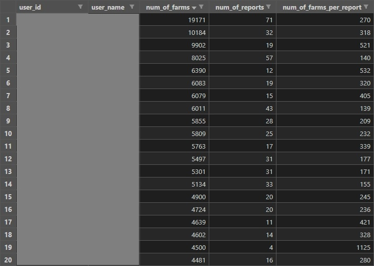
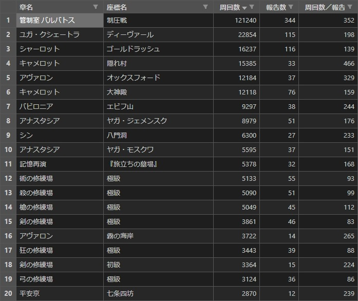

# fgo-farm-report-collection (FGO周回報告収集) <!-- omit in toc -->


# 0. 目次 <!-- omit in toc -->

- [1. 概要](#1-概要)
- [2. 機能](#2-機能)
  - [2.1. 機能一覧](#21-機能一覧)
  - [2.2. 実行結果](#22-実行結果)
    - [2.2.1. 周回報告一覧ファイル](#221-周回報告一覧ファイル)
    - [2.2.2. 周回報告ユーザ全体概要ファイル](#222-周回報告ユーザ全体概要ファイル)
    - [2.2.3. 周回報告クエスト全体概要ファイル](#223-周回報告クエスト全体概要ファイル)
    - [2.2.4. 周回報告個人概要ファイル](#224-周回報告個人概要ファイル)
- [3. 動作確認済み環境](#3-動作確認済み環境)
- [4. セットアップ手順](#4-セットアップ手順)
  - [4.1. リポジトリのクローン](#41-リポジトリのクローン)
  - [4.2. 仮想環境の構築](#42-仮想環境の構築)
- [5. 使い方](#5-使い方)
  - [5.1. 周回報告一覧生成](#51-周回報告一覧生成)
    - [5.1.1. 実行コマンド](#511-実行コマンド)
    - [5.1.2. 実行結果](#512-実行結果)
      - [5.1.2.1. 周回報告一覧ファイル](#5121-周回報告一覧ファイル)
  - [5.2. 周回報告全体概要生成](#52-周回報告全体概要生成)
    - [5.2.1. 実行コマンド](#521-実行コマンド)
    - [5.2.2. 実行結果](#522-実行結果)
      - [5.2.2.1. 周回報告ユーザ全体概要ファイル](#5221-周回報告ユーザ全体概要ファイル)
      - [5.2.2.2. 周回報告クエスト全体概要ファイル](#5222-周回報告クエスト全体概要ファイル)
  - [5.3. 周回報告個人概要生成](#53-周回報告個人概要生成)
    - [5.3.1. 実行コマンド](#531-実行コマンド)
    - [5.3.2. 実行結果](#532-実行結果)
      - [5.3.2.1. 周回報告個人概要ファイル](#5321-周回報告個人概要ファイル)
  - [5.4. 周回報告生成結果マージ](#54-周回報告生成結果マージ)
    - [5.4.1. 実行コマンド](#541-実行コマンド)
    - [5.4.2. 実行結果](#542-実行結果)
      - [5.4.2.1. 周回報告一覧マージ結果ファイル](#5421-周回報告一覧マージ結果ファイル)
      - [5.4.2.2. 周回報告ユーザ全体概要マージ結果ファイル](#5422-周回報告ユーザ全体概要マージ結果ファイル)
      - [5.4.2.3. 周回報告クエスト全体概要マージ結果ファイル](#5423-周回報告クエスト全体概要マージ結果ファイル)
      - [5.4.2.4. 周回報告個人概要マージ結果ファイル](#5424-周回報告個人概要マージ結果ファイル)
- [6. 実行コマンド一覧](#6-実行コマンド一覧)
  - [6.1. ヘルプ](#61-ヘルプ)
  - [6.2. 実行例](#62-実行例)
- [7. 連絡先](#7-連絡先)
- [8. ライセンス](#8-ライセンス)


# 1. 概要

FGOの周回報告を収集・集計し、csvファイルに保存する。


# 2. 機能


## 2.1. 機能一覧

アプリケーションとしてコマンドラインから実行できる。

- 周回報告一覧生成
  - 周回報告一覧ファイルを生成する
- 周回報告全体概要生成
  - 周回報告一覧ファイルを基に、周回報告ユーザ全体概要ファイルと周回報告クエスト全体概要ファイルを生成する
  - 任意で周回報告一覧ファイルを生成する
  - 別リポジトリの機能で周回報告ユーザ全体概要ファイルをリストとしてTwitterにインポートする
    - `twitter-app`リポジトリの`list-imp`スクリプト
- 周回報告個人概要生成
  - 周回報告一覧ファイルを基に周回報告個人概要ファイルを生成する
  - 任意で周回報告一覧ファイルを生成する
- 周回報告生成結果マージ
  - 上記で生成されたファイルをExcelファイルにマージし、マージ結果ファイルを生成する


## 2.2. 実行結果

実行結果の例である。また、`VSCode Excel Viewer`で開いている。


### 2.2.1. 周回報告一覧ファイル

指定した年月の周回報告の一覧である。


### 2.2.2. 周回報告ユーザ全体概要ファイル

周回報告による、指定した年月およびクエスト種別のユーザ(Twitter)ごとの周回概要である。




### 2.2.3. 周回報告クエスト全体概要ファイル

周回報告による、指定した年月およびクエスト種別のクエストごとの周回概要である。




### 2.2.4. 周回報告個人概要ファイル

周回報告による、指定した年およびユーザ(Twitter)の周回概要である。


# 3. 動作確認済み環境

- Windows 10 Pro
- [Python 3.10.1](https://www.python.org/downloads/release/python-3101/)
- [Poetry 1.1.12](https://python-poetry.org/docs/#installing-with-pip)


# 4. セットアップ手順

前提として、PythonとPoetryがインストール済みであること。


## 4.1. リポジトリのクローン

下記リポジトリをクローンもしくはダウンロードする。

- fgo-farm-report-collection
  - 本リポジトリ
- python-lib-for-me
  - 自分用のPythonライブラリ


## 4.2. 仮想環境の構築

下記コマンドを実行する。

```cmd
> cd fgo-farm-report-collection             # アプリケーションのパスに移動する
> poetry config virtualenvs.in-project true # 仮想環境のインストール先をプロジェクト配下に設定する
> poetry install                            # pyproject.tomlを基に仮想環境をインストールする
```

そして、下記コマンドを実行して、アプリケーション配下に`.venv`フォルダが作成されていることを確認する。

```cmd
> poetry env info --path                    # 仮想環境のインストール先を表示する
C:\Git\python\fgo-farm-report-collection\.venv
```


# 5. 使い方

アプリケーションの実行手順を機能ごとに示す。


## 5.1. 周回報告一覧生成


### 5.1.1. 実行コマンド

下記コマンドでヘルプを呼び出す。

ヘルプ：
```cmd
> poetry run list-gen -h
usage: list-gen [-h] (-y COL_YEAR | -m COL_YEAR_MONTH)

周回報告一覧生成
周回報告一覧ファイルを生成します

options:
  -h, --help            show this help message and exit

Group B - only one required arguments:
  1つのみ必須な引数
  収集する年月を指定します

  -y COL_YEAR, --col_year COL_YEAR
                        収集年(yyyy形式)
  -m COL_YEAR_MONTH, --col_year_month COL_YEAR_MONTH
                        収集年月(yyyy-mm形式)
```

また、下記コマンドは実行例である。

実行例：
```cmd
> cd fgo-farm-report-collection
> poetry run list-gen -m 2022-01
```


### 5.1.2. 実行結果

周回報告一覧ファイルが生成される。


#### 5.1.2.1. 周回報告一覧ファイル

下記パスに生成される。

| 種類         | ファイルパス                           |
| ------------ | -------------------------------------- |
| フォーマット | ./dest/farm_report_list/[収集年月].csv |
| 例           | ./dest/farm_report_list/2022-01.csv    |

また、下記画像は実行結果の例である。`VSCode Excel Viewer`で開いている。


## 5.2. 周回報告全体概要生成


### 5.2.1. 実行コマンド

下記コマンドでヘルプを呼び出す。

ヘルプ：
```cmd
> poetry run tot-gen -h
usage: tot-gen [-h] (-y COL_YEAR | -m COL_YEAR_MONTH) (-u | -q) (-a MIN_NUM_OF_ALL_QUEST | -n MIN_NUM_OF_NORMAL_QUEST | -e MIN_NUM_OF_EVENT_QUEST | -b MIN_NUM_OF_QUEST_BY_BATCH) [-l] [-un]

周回報告全体概要生成
周回報告一覧ファイルを基に周回報告全体概要ファイルを生成します
任意で周回報告一覧ファイルを生成します

options:
  -h, --help            show this help message and exit

Group B1 - only one required arguments:
  1つのみ必須な引数
  収集する年月を指定します

  -y COL_YEAR, --col_year COL_YEAR
                        収集年(yyyy形式)
  -m COL_YEAR_MONTH, --col_year_month COL_YEAR_MONTH
                        収集年月(yyyy-mm形式)

Group B2 - only one required arguments:
  1つのみ必須な引数
  処理を指定します

  -u, --generate_user_total_summary
                        周回報告ユーザ全体概要生成要否
                        周回報告ユーザ全体概要を生成します
  -q, --generate_quest_total_summary
                        周回報告クエスト全体概要生成要否
                        周回報告クエスト全体概要を生成します

Group B3 - only one required arguments:
  1つのみ必須な引数
  収集する最低周回数を指定します

  -a MIN_NUM_OF_ALL_QUEST, --min_num_of_all_quest MIN_NUM_OF_ALL_QUEST
                        最低周回数(全て)
  -n MIN_NUM_OF_NORMAL_QUEST, --min_num_of_normal_quest MIN_NUM_OF_NORMAL_QUEST
                        最低周回数(通常クエ)
  -e MIN_NUM_OF_EVENT_QUEST, --min_num_of_event_quest MIN_NUM_OF_EVENT_QUEST
                        最低周回数(イベクエ)
  -b MIN_NUM_OF_QUEST_BY_BATCH, --min_num_of_quest_by_batch MIN_NUM_OF_QUEST_BY_BATCH
                        最低周回数(3種類一括)

Group C - optional arguments:
  任意の引数

  -l, --generate_list   周回報告一覧生成要否
                        指定した場合は一覧を生成します
                        指定しない場合は生成せずに既存の一覧のみを使用します
  -un, --output_user_name
                        ユーザ名出力要否
                        指定した場合は周回報告ユーザ全体概要ファイルにユーザ名を出力します
```

また、下記コマンドは実行例である。

実行例：
```cmd
> cd fgo-farm-report-collection
> poetry run tot-gen -m 2022-01 -u -a 100
> poetry run tot-gen -m 2022-01 -q -a 100
```


### 5.2.2. 実行結果

周回報告一覧ファイルが[周回報告一覧生成](#51-周回報告一覧生成)と同様に生成され、
周回報告全体概要ファイルと周回報告クエスト全体概要ファイルが生成される。


#### 5.2.2.1. 周回報告ユーザ全体概要ファイル

下記パスに生成される。

| 種類         | ファイルパス                                                                       |
| ------------ | ---------------------------------------------------------------------------------- |
| フォーマット | ./dest/farm_report_total_summary/user/[収集年月]\_[クエスト種別]\_[最低周回数].csv |
| 例           | ./dest/farm_report_total_summary/user/2022-01_全て_100周以上.csv                   |

また、下記画像は実行結果の例である。`VSCode Excel Viewer`で開いている。


#### 5.2.2.2. 周回報告クエスト全体概要ファイル

下記パスに生成される。

| 種類         | ファイルパス                                                                        |
| ------------ | ----------------------------------------------------------------------------------- |
| フォーマット | ./dest/farm_report_total_summary/quest/[収集年月]\_[クエスト種別]\_[最低周回数].csv |
| 例           | ./dest/farm_report_total_summary/quest/2022-01_全て_100周以上.csv                   |

また、下記画像は実行結果の例である。`VSCode Excel Viewer`で開いている。


## 5.3. 周回報告個人概要生成


### 5.3.1. 実行コマンド

下記コマンドでヘルプを呼び出す。

ヘルプ：
```cmd
> poetry run ind-gen -h
usage: ind-gen [-h] [-l] col_year user_id

周回報告個人概要生成
周回報告一覧ファイルを基に周回報告個人概要ファイルを生成します
任意で周回報告一覧ファイルを生成します

options:
  -h, --help           show this help message and exit

Group A - all required arguments:
  全て必須な引数

  col_year             収集年(yyyy形式)
  user_id              ユーザID

Group C - optional arguments:
  任意の引数

  -l, --generate_list  周回報告一覧生成要否
                       指定した場合は一覧を生成します
                       指定しない場合は生成せずに既存の一覧のみを使用します
```

また、下記コマンドは実行例である。

実行例：
```cmd
> cd fgo-farm-report-collection
> poetry run ind-gen 2022 silverag_corgi
```


### 5.3.2. 実行結果

周回報告一覧ファイルが[周回報告一覧生成](#51-周回報告一覧生成)と同様に生成され、周回報告個人概要ファイルが生成される。


#### 5.3.2.1. 周回報告個人概要ファイル

下記パスに生成される。

| 種類         | ファイルパス                                                            |
| ------------ | ----------------------------------------------------------------------- |
| フォーマット | ./dest/farm_report_individual_summary/[収集年]\_[ユーザID(Twitter)].csv |
| 例           | ./dest/farm_report_individual_summary/2022_silverag_corgi.csv           |

また、下記画像は実行結果の例である。`VSCode Excel Viewer`で開いている。


## 5.4. 周回報告生成結果マージ


### 5.4.1. 実行コマンド

下記コマンドでヘルプを呼び出す。

ヘルプ：
```cmd
> poetry run merge -h
usage: merge [-h] (-l | -u | -q | -i) [-a]

周回報告生成結果マージ
生成結果をExcelファイルにマージします

options:
  -h, --help            show this help message and exit

Group B - only one required arguments:
  1つのみ必須な引数
  処理を指定します

  -l, --merge_list      周回報告一覧マージ要否
  -u, --merge_user_total_summary
                        周回報告ユーザ全体概要マージ要否
  -q, --merge_quest_total_summary
                        周回報告クエスト全体概要マージ要否
  -i, --merge_individual_summary
                        周回報告個人概要マージ要否

Group C - optional arguments:
  任意の引数

  -a, --append_gen_result
                        生成結果追記要否
                        指定した場合は生成結果をシート単位で追記します
                        指定しない場合は生成結果をシート単位で上書きします
```

また、下記コマンドは実行例である。

実行例：
```cmd
> cd fgo-farm-report-collection
> poetry run merge -u -a
```


### 5.4.2. 実行結果

4種類のマージ結果ファイルが生成される。


#### 5.4.2.1. 周回報告一覧マージ結果ファイル

下記パスに生成される。

| 種類         | ファイルパス                          |
| ------------ | ------------------------------------- |
| フォーマット | ./dest/merge_result/周回報告一覧.xlsx |


#### 5.4.2.2. 周回報告ユーザ全体概要マージ結果ファイル

下記パスに生成される。

| 種類         | ファイルパス                                    |
| ------------ | ----------------------------------------------- |
| フォーマット | ./dest/merge_result/周回報告ユーザ全体概要.xlsx |


#### 5.4.2.3. 周回報告クエスト全体概要マージ結果ファイル

下記パスに生成される。

| 種類         | ファイルパス                                      |
| ------------ | ------------------------------------------------- |
| フォーマット | ./dest/merge_result/周回報告クエスト全体概要.xlsx |


#### 5.4.2.4. 周回報告個人概要マージ結果ファイル

下記パスに生成される。

| 種類         | ファイルパス                              |
| ------------ | ----------------------------------------- |
| フォーマット | ./dest/merge_result/周回報告個人概要.xlsx |


# 6. 実行コマンド一覧


## 6.1. ヘルプ

```cmd
> poetry run list-gen -h
> poetry run tot-gen -h
> poetry run ind-gen -h
> poetry run merge -h
```


## 6.2. 実行例

```cmd
> poetry run list-gen -y 2022

> poetry run tot-gen -y 2022 -u -b 0
> poetry run tot-gen -y 2022 -q -b 0

> poetry run ind-gen 2022 silverag_corgi

> poetry run merge -l
> poetry run merge -u
> poetry run merge -q
> poetry run merge -i
```


# 7. 連絡先

[Twitter(@silverag_corgi)](https://twitter.com/silverag_corgi)


# 8. ライセンス

MITライセンスの下で公開している。
詳細はLICENSEを確認すること。

