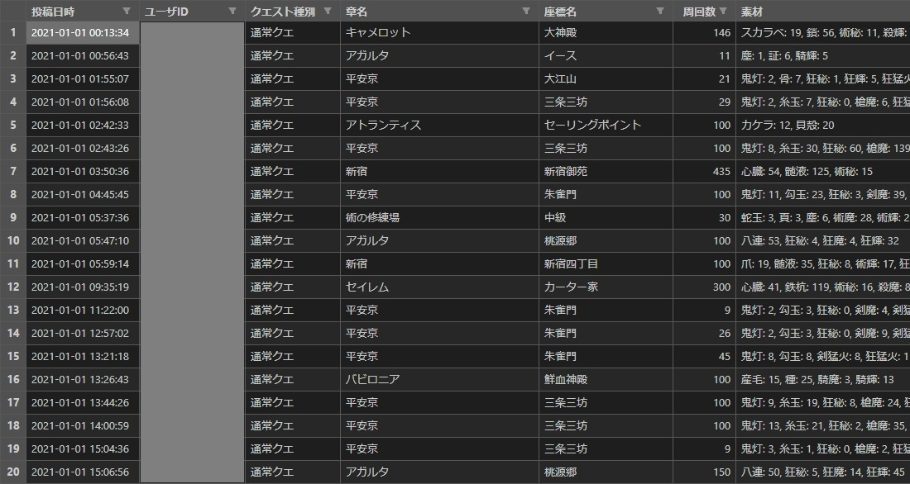

# fgo-farm-report-collection (FGO周回報告収集) <!-- omit in toc -->

## 0. 目次 <!-- omit in toc -->

- [1. 概要](#1-概要)
- [2. 機能](#2-機能)
  - [2.1. 機能一覧](#21-機能一覧)
  - [2.2. 実行結果](#22-実行結果)
    - [2.2.1. 生成結果ファイル](#221-生成結果ファイル)
      - [2.2.1.1. 周回報告一覧ファイル](#2211-周回報告一覧ファイル)
      - [2.2.1.2. 周回報告年間ユーザ全体概要ファイル](#2212-周回報告年間ユーザ全体概要ファイル)
      - [2.2.1.3. 周回報告年間クエスト全体概要ファイル](#2213-周回報告年間クエスト全体概要ファイル)
      - [2.2.1.4. 周回報告月間ユーザ全体概要ファイル](#2214-周回報告月間ユーザ全体概要ファイル)
      - [2.2.1.5. 周回報告月間クエスト全体概要ファイル](#2215-周回報告月間クエスト全体概要ファイル)
      - [2.2.1.6. 周回報告個人概要ファイル](#2216-周回報告個人概要ファイル)
    - [2.2.2. マージ結果ファイル](#222-マージ結果ファイル)
- [3. 動作確認済み環境](#3-動作確認済み環境)
- [4. セットアップ手順](#4-セットアップ手順)
  - [4.1. リポジトリのクローン](#41-リポジトリのクローン)
  - [4.2. 仮想環境の構築](#42-仮想環境の構築)
- [5. 使い方](#5-使い方)
  - [5.1. メインコマンド](#51-メインコマンド)
    - [5.1.1. ヘルプ](#511-ヘルプ)
  - [5.2. サブコマンド：周回報告一覧生成](#52-サブコマンド周回報告一覧生成)
    - [5.2.1. ヘルプ](#521-ヘルプ)
    - [5.2.2. 実行結果](#522-実行結果)
      - [5.2.2.1. 周回報告一覧ファイル](#5221-周回報告一覧ファイル)
  - [5.3. サブコマンド：周回報告全体概要生成](#53-サブコマンド周回報告全体概要生成)
    - [5.3.1. ヘルプ](#531-ヘルプ)
    - [5.3.2. 実行結果](#532-実行結果)
      - [5.3.2.1. 周回報告年間ユーザ全体概要ファイル](#5321-周回報告年間ユーザ全体概要ファイル)
      - [5.3.2.2. 周回報告年間クエスト全体概要ファイル](#5322-周回報告年間クエスト全体概要ファイル)
      - [5.3.2.3. 周回報告月間ユーザ全体概要ファイル](#5323-周回報告月間ユーザ全体概要ファイル)
      - [5.3.2.4. 周回報告月間クエスト全体概要ファイル](#5324-周回報告月間クエスト全体概要ファイル)
  - [5.4. サブコマンド：周回報告個人概要生成](#54-サブコマンド周回報告個人概要生成)
    - [5.4.1. ヘルプ](#541-ヘルプ)
    - [5.4.2. 実行結果](#542-実行結果)
      - [5.4.2.1. 周回報告個人概要ファイル](#5421-周回報告個人概要ファイル)
  - [5.5. サブコマンド：周回報告生成結果マージ](#55-サブコマンド周回報告生成結果マージ)
    - [5.5.1. ヘルプ](#551-ヘルプ)
    - [5.5.2. 実行結果](#552-実行結果)
      - [5.5.2.2. 周回報告一覧マージ結果ファイル](#5522-周回報告一覧マージ結果ファイル)
      - [5.5.2.3. 周回報告年間ユーザ全体概要マージ結果ファイル](#5523-周回報告年間ユーザ全体概要マージ結果ファイル)
      - [5.5.2.4. 周回報告年間クエスト全体概要マージ結果ファイル](#5524-周回報告年間クエスト全体概要マージ結果ファイル)
      - [5.5.2.5. 周回報告月間ユーザ全体概要マージ結果ファイル](#5525-周回報告月間ユーザ全体概要マージ結果ファイル)
      - [5.5.2.6. 周回報告月間クエスト全体概要マージ結果ファイル](#5526-周回報告月間クエスト全体概要マージ結果ファイル)
      - [5.5.2.7. 周回報告個人概要マージ結果ファイル](#5527-周回報告個人概要マージ結果ファイル)
- [6. マージ結果ファイルのURL](#6-マージ結果ファイルのurl)
- [7. 連絡先](#7-連絡先)
- [8. ライセンス](#8-ライセンス)

## 1. 概要

FGOの周回報告を収集・集計し、csvファイルに保存する。

## 2. 機能

### 2.1. 機能一覧

アプリケーションとしてコマンドラインから実行できる。

- 周回報告一覧生成
  - 周回報告一覧ファイルを生成する
- 周回報告全体概要生成
  - 事前に任意で周回報告一覧ファイルを生成する
  - 周回報告一覧ファイルを基に周回報告ユーザ全体概要ファイルと周回報告クエスト全体概要ファイルを生成する
  - 備考
    - リポジトリ`twitter-app`にて周回報告ユーザ全体概要ファイルをリストとしてTwitterにインポートする
- 周回報告個人概要生成
  - 事前に任意で周回報告一覧ファイルを生成する
  - 周回報告一覧ファイルを基に周回報告個人概要ファイルを生成する
- 周回報告生成結果マージ
  - 上記4種類の生成結果ファイルを各々のExcelファイル(マージ結果ファイル)にマージする

### 2.2. 実行結果

生成結果ファイルとマージ結果ファイルが生成される。

ここでは実行結果の例を示す。また、`VSCode Excel Viewer`で開いている。

#### 2.2.1. 生成結果ファイル

##### 2.2.1.1. 周回報告一覧ファイル

周回報告一覧である。

- 年月：2021-01



##### 2.2.1.2. 周回報告年間ユーザ全体概要ファイル

周回報告を基にした、クエスト種別ごとの年間周回概要(ユーザ編)である。

- 年月：2021
- クエスト種別：全て(通常クエ＋イベクエ)
- 最低周回数：100周以上


##### 2.2.1.3. 周回報告年間クエスト全体概要ファイル

周回報告による、クエスト種別ごとの年間周回概要(クエスト編)である。

- 年月：2021
- クエスト種別：全て(通常クエ＋イベクエ)
- 最低周回数：100周以上


##### 2.2.1.4. 周回報告月間ユーザ全体概要ファイル

周回報告を基にした、クエスト種別ごとの月間周回概要(ユーザ編)である。

- 年月：2021-01
- クエスト種別：全て(通常クエ＋イベクエ)
- 最低周回数：100周以上


##### 2.2.1.5. 周回報告月間クエスト全体概要ファイル

周回報告による、クエスト種別ごとの月間周回概要(クエスト編)である。

- 年月：2021-01
- クエスト種別：全て(通常クエ＋イベクエ)
- 最低周回数：100周以上


##### 2.2.1.6. 周回報告個人概要ファイル

周回報告による、ユーザ(Twitter)ごとの周回概要である。

- 年：2021
- ユーザID：silverag_corgi


#### 2.2.2. マージ結果ファイル

上記の生成結果ファイルを各々Excelファイルにマージしただけであるため、実行結果の例は省略する。

## 3. 動作確認済み環境

- Debian 11
- [Python 3.10.1](https://www.python.org/downloads/release/python-3101/)
- [Poetry 1.1.12](https://python-poetry.org/docs/#installing-with-pip)

## 4. セットアップ手順

前提として、PythonとPoetryがインストール済みであること。

### 4.1. リポジトリのクローン

下記リポジトリをクローンもしくはダウンロードする。

- fgo-farm-report-collection
  - 本リポジトリ
- python-lib-for-me
  - 自分用のPythonライブラリ

### 4.2. 仮想環境の構築

下記コマンドを実行する。

```shell
$ cd fgo-farm-report-collection             # アプリケーションのパスに移動する
$ poetry config virtualenvs.in-project true # 仮想環境のインストール先をプロジェクト配下に設定する
$ poetry install                            # pyproject.tomlを基に仮想環境をインストールする
```

そして、下記コマンドを実行して、アプリケーション配下に`.venv`フォルダが作成されていることを確認する。

```shell
$ poetry env info --path                    # 仮想環境のインストール先を表示する
C:\Git\python\fgo-farm-report-collection\.venv
```

## 5. 使い方

アプリケーションの実行手順を機能ごとに示す。

### 5.1. メインコマンド

#### 5.1.1. ヘルプ

下記コマンドでヘルプを呼び出す。

```shell
$ poetry run fgo -h
[INF][         MainProcess][          MainThread][                                 main.py:0021][                                    main] コマンド：['fgo', '-h']
[INF][         MainProcess][          MainThread][                           arg_parser.py:0046][                          _print_message] 
usage: fgo [-h] [-d] {gen-list,gen-tot,gen-ind,merge} ...

fgo-farm-report-collection (FGO周回報告収集)
FGOの周回報告を収集・集計し、csvファイルやxlsxファイルに保存します。

options:
  -h, --help            show this help message and exit
  -d, --use_debug_mode  デバッグモード使用有無

sub_commands:
  {gen-list,gen-tot,gen-ind,merge}
    gen-list            - 機能名
                            - 周回報告一覧生成
                        - 概要
                            - 周回報告一覧ファイルを生成します
                        - 生成ファイル
                            - 周回報告一覧ファイル
                                - ./dest/farm_report_list/[収集年月].csv
                        - コマンド例
                            - poetry run fgo gen-list -y 2021
                            - poetry run fgo gen-list -m 2021-01
    gen-tot             - 機能名
                            - 周回報告全体概要生成
                        - 概要
                            - 事前に任意で周回報告一覧ファイルを生成します
                            - 周回報告一覧ファイルを基に周回報告全体概要ファイルを生成します
                        - 生成ファイル
                            - 周回報告一覧ファイル
                                - ./dest/farm_report_list/[収集年月].csv
                            - 周回報告年間ユーザ全体概要ファイル
                                - ./dest/farm_report_total_summary/yearly_user/[収集年]_[クエスト種別]_[最低周回数].csv
                            - 周回報告年間クエスト全体概要ファイル
                                - ./dest/farm_report_total_summary/yearly_quest/[収集年]_[クエスト種別]_[最低周回数].csv
                            - 周回報告月間ユーザ全体概要ファイル
                                - ./dest/farm_report_total_summary/monthly_user/[収集年月]_[クエスト種別]_[最低周回数].csv
                            - 周回報告月間クエスト全体概要ファイル
                                - ./dest/farm_report_total_summary/monthly_quest/[収集年月]_[クエスト種別]_[最低周回数].csv
                        - コマンド例
                            - poetry run fgo gen-tot -y 2021 -yu -a 100 -u
                            - poetry run fgo gen-tot -y 2021 -yq -a 100
                            - poetry run fgo gen-tot -y 2021 -mu -a 100 -u
                            - poetry run fgo gen-tot -y 2021 -mq -a 100
                            - poetry run fgo gen-tot -m 2021-01 -mu -a 100 -u
                            - poetry run fgo gen-tot -m 2021-01 -mq -a 100
    gen-ind             - 機能名
                            - 周回報告個人概要生成
                        - 概要
                            - 事前に任意で周回報告一覧ファイルを生成します
                            - 周回報告一覧ファイルを基に周回報告個人概要ファイルを生成します
                        - 生成ファイル
                            - 周回報告一覧ファイル
                                - ./dest/farm_report_list/[収集年月].csv
                            - 周回報告個人概要ファイル
                                - ./dest/farm_report_individual_summary/[収集年]_[ユーザID].csv
                        - コマンド例
                            - poetry run fgo gen-ind 2021 silverag_corgi
    merge               - 機能名
                            - 周回報告生成結果マージ
                        - 概要
                            - 生成結果をExcelファイル(マージ結果ファイル)にマージします
                        - 生成ファイル
                            - 周回報告一覧マージ結果ファイル
                                - ./dest/merge_result/周回報告一覧.xlsx
                            - 周回報告年間ユーザ全体概要マージ結果ファイル
                                - ./dest/merge_result/周回報告年間ユーザ全体概要.xlsx
                            - 周回報告年間クエスト全体概要マージ結果ファイル
                                - ./dest/merge_result/周回報告年間クエスト全体概要.xlsx
                            - 周回報告月間ユーザ全体概要マージ結果ファイル
                                - ./dest/merge_result/周回報告ユーザ全体概要.xlsx
                            - 周回報告月間クエスト全体概要マージ結果ファイル
                                - ./dest/merge_result/周回報告クエスト全体概要.xlsx
                            - 周回報告個人概要マージ結果ファイル
                                - ./dest/merge_result/周回報告個人概要.xlsx
                        - コマンド例
                            - poetry run fgo merge -l
                            - poetry run fgo merge -yu
                            - poetry run fgo merge -yq
                            - poetry run fgo merge -mu
                            - poetry run fgo merge -mq
                            - poetry run fgo merge -i
```

### 5.2. サブコマンド：周回報告一覧生成

#### 5.2.1. ヘルプ

下記コマンドでヘルプを呼び出す。

```shell
$ poetry run fgo gen-list -h
[INF][         MainProcess][          MainThread][                                 main.py:0021][                                    main] コマンド：['fgo', 'gen-list', '-h']
[INF][         MainProcess][          MainThread][                           arg_parser.py:0046][                          _print_message] 
usage: fgo gen-list [-h] [-y COL_YEAR | -m COL_YEAR_MONTH]

options:
  -h, --help            show this help message and exit
  -y COL_YEAR, --col_year COL_YEAR
                        - [グループB(1つのみ必須)] 収集年(yyyy形式)
  -m COL_YEAR_MONTH, --col_year_month COL_YEAR_MONTH
                        - [グループB(1つのみ必須)] 収集年月(yyyy-mm形式)
```

#### 5.2.2. 実行結果

周回報告一覧ファイルが生成される。

##### 5.2.2.1. 周回報告一覧ファイル

例として下記コマンドを実行する。

```shell
$ poetry run fgo gen-list -m 2021-01
```

実行することにより、ファイルが下記パスに生成される。

| 種類         | ファイルパス                           |
| ------------ | -------------------------------------- |
| フォーマット | ./dest/farm_report_list/[収集年月].csv |
| 例           | ./dest/farm_report_list/2021-01.csv    |

ファイルの中身は以下の通りである。また`VSCode Excel Viewer`で開いている。


### 5.3. サブコマンド：周回報告全体概要生成

#### 5.3.1. ヘルプ

下記コマンドでヘルプを呼び出す。

```shell
$ poetry run fgo gen-tot -h
[INF][         MainProcess][          MainThread][                                 main.py:0021][                                    main] コマンド：['fgo', 'gen-tot', '-h']
[INF][         MainProcess][          MainThread][                           arg_parser.py:0046][                          _print_message] 
usage: fgo gen-tot [-h] [-y COL_YEAR | -m COL_YEAR_MONTH] [-yu | -yq | -mu | -mq] [-a MIN_NUM_OF_ALL_QUEST | -n MIN_NUM_OF_NORMAL_QUEST | -e MIN_NUM_OF_EVENT_QUEST | -b MIN_NUM_OF_QUEST_BY_BATCH]
                   [-l] [-u]

options:
  -h, --help            show this help message and exit
  -y COL_YEAR, --col_year COL_YEAR
                        - [グループB1(1つのみ必須)] 収集年(yyyy形式)
  -m COL_YEAR_MONTH, --col_year_month COL_YEAR_MONTH
                        - [グループB1(1つのみ必須)] 収集年月(yyyy-mm形式)
  -yu, --generate_yearly_user_total_summary
                        - [グループB2(1つのみ必須)] 周回報告年間ユーザ全体概要生成要否
                            - 収集年を指定した場合にのみ、周回報告年間ユーザ全体概要を生成します
                            - 収集年月を指定した場合はエラーになります
  -yq, --generate_yearly_quest_total_summary
                        - [グループB2(1つのみ必須)] 周回報告年間クエスト全体概要生成要否
                            - 収集年を指定した場合にのみ、周回報告年間クエスト全体概要を生成します
                            - 収集年月を指定した場合はエラーになります
  -mu, --generate_monthly_user_total_summary
                        - [グループB2(1つのみ必須)] 周回報告月間ユーザ全体概要生成要否
                            - 周回報告月間ユーザ全体概要を生成します
  -mq, --generate_monthly_quest_total_summary
                        - [グループB2(1つのみ必須)] 周回報告月間クエスト全体概要生成要否
                            - 周回報告月間クエスト全体概要を生成します
  -a MIN_NUM_OF_ALL_QUEST, --min_num_of_all_quest MIN_NUM_OF_ALL_QUEST
                        - [グループB3(1つのみ必須)] 最低周回数(全て)
  -n MIN_NUM_OF_NORMAL_QUEST, --min_num_of_normal_quest MIN_NUM_OF_NORMAL_QUEST
                        - [グループB3(1つのみ必須)] 最低周回数(通常クエ)
  -e MIN_NUM_OF_EVENT_QUEST, --min_num_of_event_quest MIN_NUM_OF_EVENT_QUEST
                        - [グループB3(1つのみ必須)] 最低周回数(イベクエ)
  -b MIN_NUM_OF_QUEST_BY_BATCH, --min_num_of_quest_by_batch MIN_NUM_OF_QUEST_BY_BATCH
                        - [グループB3(1つのみ必須)] 最低周回数(3種類一括)
  -l, --generate_list   - [グループC(任意)] 周回報告一覧生成要否
                            - 指定した場合は一覧を生成します
                            - 指定しない場合は生成せずに既存の一覧のみを使用します
  -u, --output_user_name
                        - [グループC(任意)] ユーザ名出力要否
                            - 指定した場合は周回報告ユーザ全体概要ファイルにユーザ名を出力します
```

#### 5.3.2. 実行結果

周回報告一覧ファイルが[5.2. サブコマンド：周回報告一覧生成](#52-サブコマンド周回報告一覧生成)と同様に生成され、周回報告全体概要ファイルが生成される。

##### 5.3.2.1. 周回報告年間ユーザ全体概要ファイル

例として下記コマンドを実行する。

```shell
$ poetry run fgo gen-tot -y 2021 -yu -a 100 -u
```

実行することにより、ファイルが下記パスに生成される。

| 種類         | ファイルパス                                                                            |
| ------------ | --------------------------------------------------------------------------------------- |
| フォーマット | ./dest/farm_report_total_summary/yearly_user/[収集年]\_[クエスト種別]\_[最低周回数].csv |
| 例           | ./dest/farm_report_total_summary/yearly_user/2021_全て_100周以上.csv                    |

ファイルの中身は以下の通りである。また`VSCode Excel Viewer`で開いている。


##### 5.3.2.2. 周回報告年間クエスト全体概要ファイル

例として下記コマンドを実行する。

```shell
$ poetry run fgo gen-tot -y 2021 -yq -a 100
```

実行することにより、ファイルが下記パスに生成される。

| 種類         | ファイルパス                                                                             |
| ------------ | ---------------------------------------------------------------------------------------- |
| フォーマット | ./dest/farm_report_total_summary/yearly_quest/[収集年]\_[クエスト種別]\_[最低周回数].csv |
| 例           | ./dest/farm_report_total_summary/yearly_quest/2021_全て_100周以上.csv                    |

ファイルの中身は以下の通りである。また`VSCode Excel Viewer`で開いている。


##### 5.3.2.3. 周回報告月間ユーザ全体概要ファイル

例として下記コマンドを実行する。

```shell
$ poetry run fgo gen-tot -m 2021-01 -mu -a 100 -u
```

実行することにより、ファイルが下記パスに生成される。

| 種類         | ファイルパス                                                                               |
| ------------ | ------------------------------------------------------------------------------------------ |
| フォーマット | ./dest/farm_report_total_summary/monthly_user/[収集年月]\_[クエスト種別]\_[最低周回数].csv |
| 例           | ./dest/farm_report_total_summary/monthly_user/2021-01_全て_100周以上.csv                   |

ファイルの中身は以下の通りである。また`VSCode Excel Viewer`で開いている。


##### 5.3.2.4. 周回報告月間クエスト全体概要ファイル

例として下記コマンドを実行する。

```shell
$ poetry run fgo gen-tot -m 2021-01 -mq -a 100
```

実行することにより、ファイルが下記パスに生成される。

| 種類         | ファイルパス                                                                                |
| ------------ | ------------------------------------------------------------------------------------------- |
| フォーマット | ./dest/farm_report_total_summary/monthly_quest/[収集年月]\_[クエスト種別]\_[最低周回数].csv |
| 例           | ./dest/farm_report_total_summary/monthly_quest/2021-01_全て_100周以上.csv                   |

ファイルの中身は以下の通りである。また`VSCode Excel Viewer`で開いている。


### 5.4. サブコマンド：周回報告個人概要生成

#### 5.4.1. ヘルプ

下記コマンドでヘルプを呼び出す。

```shell
$ poetry run fgo gen-ind -h
[INF][         MainProcess][          MainThread][                                 main.py:0021][                                    main] コマンド：['fgo', 'gen-ind', '-h']
[INF][         MainProcess][          MainThread][                           arg_parser.py:0046][                          _print_message] 
usage: fgo gen-ind [-h] [-l] col_year user_id

positional arguments:
  col_year             - [グループA(必須)] 収集年(yyyy形式)
  user_id              - [グループA(必須)] ユーザID

options:
  -h, --help           show this help message and exit
  -l, --generate_list  - [グループC(任意)] 周回報告一覧生成要否
                           - 指定した場合は一覧を生成します
                           - 指定しない場合は生成せずに既存の一覧のみを使用します
```

#### 5.4.2. 実行結果

周回報告一覧ファイルが[5.2. サブコマンド：周回報告一覧生成](#52-サブコマンド周回報告一覧生成)と同様に生成され、周回報告個人概要ファイルが生成される。

##### 5.4.2.1. 周回報告個人概要ファイル

例として下記コマンドを実行する。

```shell
$ poetry run fgo gen-ind 2021 silverag_corgi
```

実行することにより、ファイルが下記パスに生成される。

| 種類         | ファイルパス                                                            |
| ------------ | ----------------------------------------------------------------------- |
| フォーマット | ./dest/farm_report_individual_summary/[収集年]\_[ユーザID(Twitter)].csv |
| 例           | ./dest/farm_report_individual_summary/2021_silverag_corgi.csv           |

ファイルの中身は以下の通りである。また`VSCode Excel Viewer`で開いている。


### 5.5. サブコマンド：周回報告生成結果マージ

#### 5.5.1. ヘルプ

下記コマンドでヘルプを呼び出す。

```shell
$ poetry run fgo merge -h
[INF][         MainProcess][          MainThread][                                 main.py:0021][                                    main] コマンド：['fgo', 'merge', '-h']
[INF][         MainProcess][          MainThread][                           arg_parser.py:0046][                          _print_message] 
usage: fgo merge [-h] [-l | -yu | -yq | -mu | -mq | -i] [-a]

options:
  -h, --help            show this help message and exit
  -l, --merge_list      - [グループB1(1つのみ必須)] 周回報告一覧マージ要否
  -yu, --merge_yearly_user_total_summary
                        - [グループB1(1つのみ必須)] 周回報告年間ユーザ全体概要マージ要否
  -yq, --merge_yearly_quest_total_summary
                        - [グループB1(1つのみ必須)] 周回報告年間クエスト全体概要マージ要否
  -mu, --merge_monthly_user_total_summary
                        - [グループB1(1つのみ必須)] 周回報告月間ユーザ全体概要マージ要否
  -mq, --merge_monthly_quest_total_summary
                        - [グループB1(1つのみ必須)] 周回報告月間クエスト全体概要マージ要否
  -i, --merge_individual_summary
                        - [グループB1(1つのみ必須)] 周回報告個人概要マージ要否
  -a, --append_sheet    - [グループC(任意)] シート追加要否
                            - 指定した場合は既存のシートは変更せず、新規のシートのみを追加します
                            - 指定しない場合は全てのシートを上書きします
```

#### 5.5.2. 実行結果

マージ結果ファイルが生成される。

##### 5.5.2.2. 周回報告一覧マージ結果ファイル

例として下記コマンドを実行する。

```shell
$ poetry run fgo merge -l
```

実行することにより、ファイルが下記パスに生成される。

| 種類         | ファイルパス                          |
| ------------ | ------------------------------------- |
| フォーマット | ./dest/merge_result/周回報告一覧.xlsx |

##### 5.5.2.3. 周回報告年間ユーザ全体概要マージ結果ファイル

例として下記コマンドを実行する。

```shell
$ poetry run fgo merge -yu
```

実行することにより、ファイルが下記パスに生成される。

| 種類         | ファイルパス                                        |
| ------------ | --------------------------------------------------- |
| フォーマット | ./dest/merge_result/周回報告年間ユーザ全体概要.xlsx |

##### 5.5.2.4. 周回報告年間クエスト全体概要マージ結果ファイル

例として下記コマンドを実行する。

```shell
$ poetry run fgo merge -yq
```

実行することにより、ファイルが下記パスに生成される。

| 種類         | ファイルパス                                          |
| ------------ | ----------------------------------------------------- |
| フォーマット | ./dest/merge_result/周回報告年間クエスト全体概要.xlsx |

##### 5.5.2.5. 周回報告月間ユーザ全体概要マージ結果ファイル

例として下記コマンドを実行する。

```shell
$ poetry run fgo merge -mu
```

実行することにより、ファイルが下記パスに生成される。

| 種類         | ファイルパス                                    |
| ------------ | ----------------------------------------------- |
| フォーマット | ./dest/merge_result/周回報告ユーザ全体概要.xlsx |

##### 5.5.2.6. 周回報告月間クエスト全体概要マージ結果ファイル

例として下記コマンドを実行する。

```shell
$ poetry run fgo merge -mq
```

実行することにより、ファイルが下記パスに生成される。

| 種類         | ファイルパス                                      |
| ------------ | ------------------------------------------------- |
| フォーマット | ./dest/merge_result/周回報告クエスト全体概要.xlsx |

##### 5.5.2.7. 周回報告個人概要マージ結果ファイル

例として下記コマンドを実行する。

```shell
$ poetry run fgo merge -i
```

実行することにより、ファイルが下記パスに生成される。

| 種類         | ファイルパス                              |
| ------------ | ----------------------------------------- |
| フォーマット | ./dest/merge_result/周回報告個人概要.xlsx |

## 6. マージ結果ファイルのURL

マージ結果ファイルをGoogleドライブ経由にて下記リンクで公開している。

- 周回報告年間ユーザ全体概要マージ結果ファイル
  - [スプレッドシート版](https://docs.google.com/spreadsheets/d/1jyXv6IKaN7N9QE4evZpw56jomHPYS2QJ/edit?usp=sharing&ouid=106816149049152778475&rtpof=true&sd=true)
  - [Webサイト版](https://docs.google.com/spreadsheets/d/e/2PACX-1vTUdbvY1GqU4JUvVXG1auz__mr62vjBdQ7K_kdC_l0avvZWT1xGTqHXowVqc0tP8Q/pubhtml)

- 周回報告年間クエスト全体概要マージ結果ファイル
  - [スプレッドシート版](https://docs.google.com/spreadsheets/d/1jwL2xBWNgg6tJm3G_WPnJTU14OJNyaXx/edit?usp=sharing&ouid=106816149049152778475&rtpof=true&sd=true)
  - [Webサイト版](https://docs.google.com/spreadsheets/d/e/2PACX-1vTFASRz5wHOY0UHtLScg--1yBhMb3vYH8wmYBavDRLcY8z2rX4ykpOmA-TYvEUeFw/pubhtml)

- 周回報告月間ユーザ全体概要マージ結果ファイル
  - [スプレッドシート版](https://docs.google.com/spreadsheets/d/1fupclGtdYSTMs-s9vOjQZPr3D9nF18bL/edit?usp=sharing&ouid=106816149049152778475&rtpof=true&sd=true)
  - [Webサイト版](https://docs.google.com/spreadsheets/d/e/2PACX-1vSXSRzQvhFYMx430bwbSavdzIo5uo7e9NYnVZDTZJNUW5oI7mHJcWkdi0GV_YPYQg/pubhtml)

- 周回報告月間クエスト全体概要マージ結果ファイル
  - [スプレッドシート版](https://docs.google.com/spreadsheets/d/1g-I1Y0GCjGdsE4ia3qTlaoPdF3DtpMCm/edit?usp=sharing&ouid=106816149049152778475&rtpof=true&sd=true)
  - [Webサイト版](https://docs.google.com/spreadsheets/d/e/2PACX-1vTnHSDy7kFA4X-ICwTq5yYOx8nBU2DSMfHRJ04-Qt2_zg5nuWc1HdMTOYPzRFEWAQ/pubhtml)

## 7. 連絡先

[Twitter(@silverag_corgi)](https://twitter.com/silverag_corgi)

## 8. ライセンス

MITライセンスの下で公開している。
詳細はLICENSEを確認すること。
