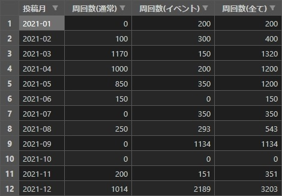

# fgo-farm-report-collection (FGO周回報告収集) <!-- omit in toc -->


# 0. 目次 <!-- omit in toc -->

- [1. 概要](#1-概要)
- [2. 機能](#2-機能)
  - [2.1. 機能一覧](#21-機能一覧)
  - [2.2. 実行結果](#22-実行結果)
- [3. 動作確認済み環境](#3-動作確認済み環境)
- [4. セットアップ手順](#4-セットアップ手順)
  - [4.1. リポジトリのクローン](#41-リポジトリのクローン)
  - [4.2. 仮想環境の構築](#42-仮想環境の構築)
- [5. 使い方](#5-使い方)
  - [5.1. 周回報告一覧生成](#51-周回報告一覧生成)
    - [5.1.1. 実行コマンド](#511-実行コマンド)
    - [5.1.2. 実行結果](#512-実行結果)
  - [5.2. 周回報告全体概要生成](#52-周回報告全体概要生成)
    - [5.2.1. 実行コマンド](#521-実行コマンド)
    - [5.2.2. 実行結果](#522-実行結果)
  - [5.3. 周回報告個人概要生成](#53-周回報告個人概要生成)
    - [5.3.1. 実行コマンド](#531-実行コマンド)
    - [5.3.2. 実行結果](#532-実行結果)
- [6. 実行コマンド一覧](#6-実行コマンド一覧)
- [7. 連絡先](#7-連絡先)
- [8. ライセンス](#8-ライセンス)


# 1. 概要

FGOの周回報告をWebスクレイピングにより収集・集計し、csvファイルに保存する。


# 2. 機能


## 2.1. 機能一覧

アプリケーションとしてコマンドラインから実行できる。

- 周回報告一覧生成
  - 周回報告一覧ファイルを生成する
- 周回報告全体概要生成
  - 周回報告一覧ファイルを基に周回報告全体概要ファイルを生成する
  - 任意で周回報告一覧ファイルを生成する
- 周回報告個人概要生成
  - 周回報告一覧ファイルを基に周回報告個人概要ファイルを生成する
  - 任意で周回報告一覧ファイルを生成する


## 2.2. 実行結果

下記画像が実行結果の例である。また、エディタ`editcsv`で開いている。

- 周回報告一覧ファイル
  - 指定した年月の周回報告の一覧
  - 
- 周回報告全体概要ファイル
  - 周回報告による、指定した年月のTwitterユーザごとの周回数
  - `twitter-lib-for-me`リポジトリの入力ファイルになる
  - 
- 周回報告個人概要ファイル
  - 周回報告による、指定した年およびTwitterユーザの月ごとの周回数
  - 


# 3. 動作確認済み環境

- Windows 10 Pro
- Python 3.10.1
- Poetry 1.1.12


# 4. セットアップ手順

前提として、PythonとPoetryがインストール済みであること。


## 4.1. リポジトリのクローン

下記リポジトリをクローンもしくはダウンロードする。

- fgo-farm-report-collection
  - 本リポジトリ
- python-lib-for-me
  - 自分用のPythonライブラリ


## 4.2. 仮想環境の構築

下記コマンドを実行する。

```cmd
> cd fgo-farm-report-collection             # アプリケーションのパスに移動する
> poetry config virtualenvs.in-project true # 仮想環境のインストール先をプロジェクト配下に設定する
> poetry install                            # pyproject.tomlを基に仮想環境をインストールする
```

そして、下記コマンドを実行して、アプリケーション配下に`.venv`フォルダが作成されていることを確認する。

```cmd
> poetry env info --path                    # 仮想環境のインストール先を表示する
C:\Git\python\fgo-farm-report-collection\.venv
```


# 5. 使い方

アプリケーションの実行手順を機能ごとに示す。


## 5.1. 周回報告一覧生成


### 5.1.1. 実行コマンド

下記コマンドを実行する。

実行例：
```cmd
> cd fgo-farm-report-collection
> poetry run list-gen -m 2022-01
```

また、ヘルプを呼び出す時は下記コマンドを実行する。

```cmd
> poetry run list-gen -h
usage: list-gen [-h] (-y COL_YEAR | -m COL_YEAR_MONTH)

周回報告一覧生成
周回報告一覧ファイルを生成します

options:
  -h, --help            show this help message and exit

options in this group:
  収集する年月を指定します

  -y COL_YEAR, --col_year COL_YEAR
                        [1つのみ必須] 収集年(yyyy形式)
  -m COL_YEAR_MONTH, --col_year_month COL_YEAR_MONTH
                        [1つのみ必須] 収集年月(yyyy-mm形式)
```


### 5.1.2. 実行結果

周回報告一覧ファイルが下記パスに生成される。

| 種類         | ファイルパス                                             |
| ------------ | -------------------------------------------------------- |
| フォーマット | ./dest/farm_report_list/farm_report_list\_[収集年月].csv |
| 例           | ./dest/farm_report_list/farm_report_list_2022-01.csv     |

また、下記画像は実行結果の例である。エディタ`editcsv`で開いている。


## 5.2. 周回報告全体概要生成


### 5.2.1. 実行コマンド

下記コマンドを実行する。

実行例：
```cmd
> cd fgo-farm-report-collection
> poetry run tot-gen 2022-01 -a 100
```

また、ヘルプを呼び出す時は下記コマンドを実行する。

```cmd
> poetry run tot-gen -h
usage: tot-gen [-h] (-a MIN_NUM_OF_ALL_QUEST | -n MIN_NUM_OF_NORMAL_QUEST | -e MIN_NUM_OF_EVENT_QUEST) [-l] [-u] col_year_month

周回報告全体概要生成
周回報告一覧ファイルを基に周回報告全体概要ファイルを生成します
任意で周回報告一覧ファイルを生成します

positional arguments:
  col_year_month        [必須] 収集年月(yyyy-mm形式)

options:
  -h, --help            show this help message and exit
  -l, --generate_list   [任意] 周回報告一覧生成要否
                        指定した場合は一覧を生成します
                        指定しない場合は生成せずに既存の一覧のみを使用します
  -u, --output_user_name
                        [任意] ユーザ名出力要否
                        指定した場合は周回報告概要ファイルにユーザ名を出力します

options in this group:
  収集する最低周回数を指定します

  -a MIN_NUM_OF_ALL_QUEST, --min_num_of_all_quest MIN_NUM_OF_ALL_QUEST
                        [1つのみ必須] 最低周回数(全て)
  -n MIN_NUM_OF_NORMAL_QUEST, --min_num_of_normal_quest MIN_NUM_OF_NORMAL_QUEST
                        [1つのみ必須] 最低周回数(通常クエ)
  -e MIN_NUM_OF_EVENT_QUEST, --min_num_of_event_quest MIN_NUM_OF_EVENT_QUEST
                        [1つのみ必須] 最低周回数(イベクエ)
```


### 5.2.2. 実行結果

周回報告一覧ファイルが[周回報告一覧生成](#51-周回報告一覧生成)と同様に生成され、周回報告全体概要ファイルが下記パスに生成される。

| 種類         | ファイルパス                                                                                             |
| ------------ | -------------------------------------------------------------------------------------------------------- |
| フォーマット | ./dest/farm_report_total_summary/farm_report_total_summary\_[収集年月]\_[クエスト種別]\_[最低周回数].csv |
| 例           | ./dest/farm_report_total_summary/farm_report_total_summary_2022-01_全て_100周以上.csv                    |

また、下記画像は実行結果の例である。エディタ`editcsv`で開いている。


## 5.3. 周回報告個人概要生成


### 5.3.1. 実行コマンド

下記コマンドを実行する。

実行例：
```cmd
> cd fgo-farm-report-collection
> poetry run ind-gen 2022 silverag_corgi
```

また、ヘルプを呼び出す時は下記コマンドを実行する。

```cmd
> poetry run ind-gen -h
usage: ind-gen [-h] [-l] col_year user_id

周回報告個人概要生成
周回報告一覧ファイルを基に周回報告個人概要ファイルを生成します
任意で周回報告一覧ファイルを生成します

positional arguments:
  col_year             [必須] 収集年(yyyy形式)
  user_id              [必須] ユーザID

options:
  -h, --help           show this help message and exit
  -l, --generate_list  [任意] 周回報告一覧生成要否
                       指定した場合は一覧を生成します
                       指定しない場合は生成せずに既存の一覧のみを使用します
```


### 5.3.2. 実行結果

周回報告一覧ファイルが[周回報告一覧生成](#51-周回報告一覧生成)と同様に生成され、周回報告個人概要ファイルが下記パスに生成される。

| 種類         | ファイルパス                                                                                            |
| ------------ | ------------------------------------------------------------------------------------------------------- |
| フォーマット | ./dest/farm_report_individual_summary/farm_report_individual_summary\_[収集年]\_[ユーザID(Twitter)].csv |
| 例           | ./dest/farm_report_individual_summary/farm_report_individual_summary_2022_silverag_corgi.csv            |

また、下記画像は実行結果の例である。エディタ`editcsv`で開いている。


# 6. 実行コマンド一覧

```cmd
> poetry run list-gen -h
> poetry run tot-gen -h
> poetry run ind-gen -h
```


# 7. 連絡先

[Twitter(@silverag_corgi)](https://twitter.com/silverag_corgi)


# 8. ライセンス

MITライセンスの下で公開している。
詳細はLICENSEを確認すること。

